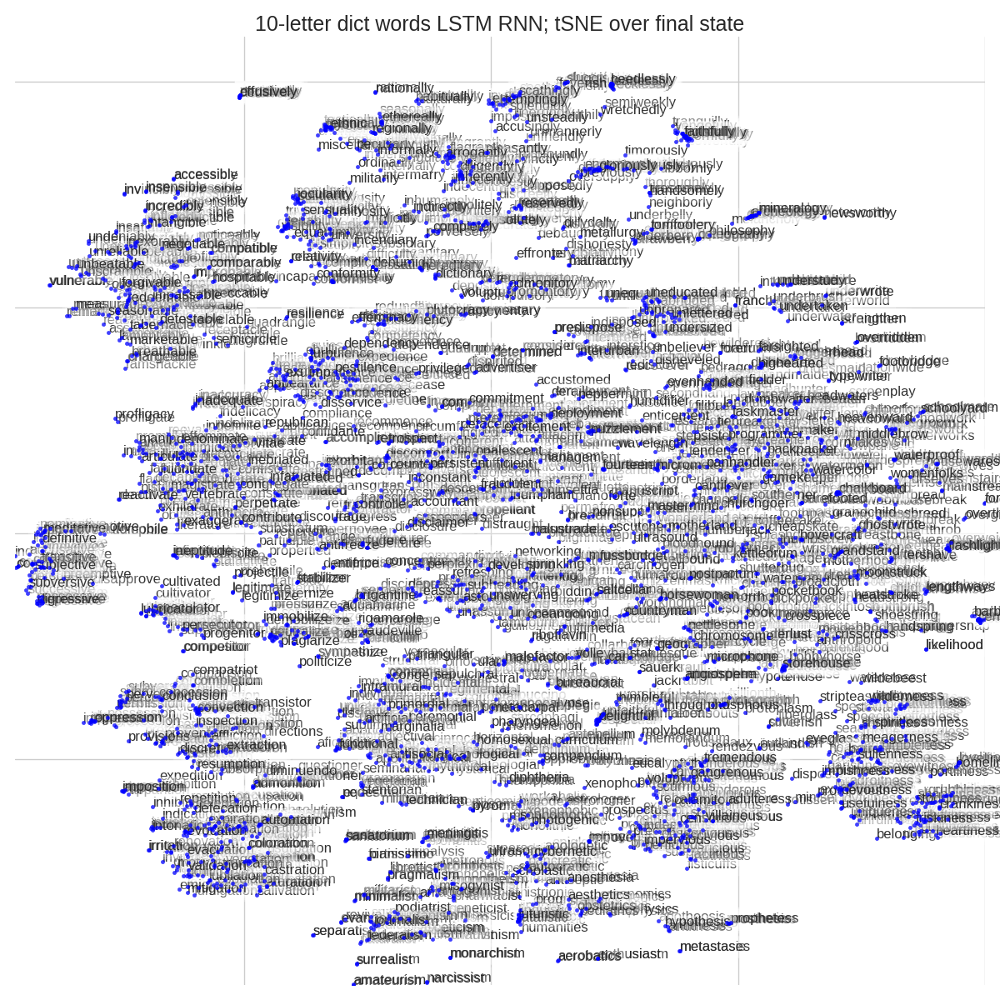

# Deep Phonics
Instead of using a Recurrent Neural Network for language modeling, let's see if it can teach us anything about spelling?

--------------------------------------------------------------------

This project builds from the work of [char-rnn-tensorflow](https://github.com/sherjilozair/char-rnn-tensorflow), itself inspired from Andrej Karpathy's [char-rnn](https://github.com/karpathy/char-rnn).

--------------------------------------------------------------------

### Presentation

http://thoppe.github.io/deep-phonics/HnT_pres.html#/

First presented at [DC Hack && Tell Round 33: NULL adhesive heresy](https://www.meetup.com/DC-Hack-and-Tell/events/227724726/).

--------------------------------------------------------------------

  
--------------------------------------------------------------------

## Scratchpad

Train a LSTM RNN over a dictionary in a randomized order.

Run `train.py`
Run `sample.py` or `multi_sample.py`
Run `view_words.py` to see samples

Run `measure_words?`

And quote this guy!

[Meet this year’s youngest Spelling Bee competitor](https://www.youtube.com/watch?v=bAOoFGCh1eY)

# thunderstrine

https://en.wikipedia.org/wiki/Letter_frequency#Relative_frequencies_of_the_first_letters_of_a_word_in_the_English_language

